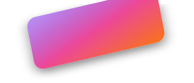

<div align="center">



# @gfazioli/react-tilt

**Interactive 3D tilt cards for React. Parallax, glare, light, shadow, gyroscope, spring physics, keyboard.**

[](https://www.npmjs.com/package/@gfazioli/react-tilt)
[](https://bundlephobia.com/package/@gfazioli/react-tilt)
[](https://www.npmjs.com/package/@gfazioli/react-tilt)
[](https://www.npmjs.com/package/@gfazioli/react-tilt)
[](./LICENSE)

[](https://twitter.com/intent/tweet?text=%40gfazioli%2Freact-tilt%20%E2%80%94%20interactive%203D%20tilt%20cards%20for%20React%3A%20parallax%2C%20glare%2C%20gyroscope%20%26%20spring%20physics.%20Zero%20runtime%20dependencies.&url=https%3A%2F%2Fgfazioli.github.io%2Freact-tilt%2F)
[](https://www.linkedin.com/sharing/share-offsite/?url=https%3A%2F%2Fgfazioli.github.io%2Freact-tilt%2F)
[](https://www.facebook.com/sharer/sharer.php?u=https%3A%2F%2Fgfazioli.github.io%2Freact-tilt%2F)
[](https://bsky.app/intent/compose?text=%40gfazioli%2Freact-tilt%20%E2%80%94%20interactive%203D%20tilt%20cards%20for%20React%3A%20parallax%2C%20glare%2C%20gyroscope%20%26%20spring%20physics.%20Zero%20runtime%20dependencies.%20https%3A%2F%2Fgfazioli.github.io%2Freact-tilt%2F)
[](https://www.threads.net/intent/post?text=%40gfazioli%2Freact-tilt%20%E2%80%94%20interactive%203D%20tilt%20cards%20for%20React%3A%20parallax%2C%20glare%2C%20gyroscope%20%26%20spring%20physics.%20Zero%20runtime%20dependencies.%20https%3A%2F%2Fgfazioli.github.io%2Freact-tilt%2F)

[**Live playground →**](https://gfazioli.github.io/react-tilt/) ・
[**Changelog**](./CHANGELOG.md)

</div>

<br/>

> Wrap any element into an interactive 3D card that tilts with the cursor, with optional parallax depth, glare, light, shadow, gyroscope and spring physics. Zero runtime dependencies, ~6 KB gzipped.

- 🎴 **Drop-in interactive card** — wrap any element in `<Tilt>` and it instantly gets cursor-driven 3D tilt and an optional hover scale.
- 🪟 **Layered parallax** — wrap any child in `<Tilt.Layer depth={n}>` and it floats at its own rate. Different layers move at different speeds — Apple-TV style.
- ✨ **All the effects, optional** — `lightEffect`, `glareEffect`, `shadowEffect`, plus background and content parallax. Compose what you need.
- 🪀 **Spring physics built in** — flip `springEffect` to swap CSS transitions for damped harmonic motion. Tune `springStiffness` and `springDamping` for the exact feel.
- 📱 **Mobile, keyboard, gyroscope** — touch is on by default. Opt into `gyroscopeEnabled` (it even handles the iOS 13+ permission prompt) and `keyboardEnabled` for full accessibility.
- 🎨 **Themeable via CSS variables** — `--rtilt-radius` rounds the card without touching JS.
- 📦 **Zero runtime dependencies** — only React as a peer dependency.
- 🪶 **Tiny** — ~6 KB ESM gzipped, tree-shakeable, dual ESM + CJS.
- ⌨️ **TypeScript-first** — full type declarations included.
- ♿ **Reduced-motion aware** — respects `prefers-reduced-motion`.

## Install

```bash
npm install @gfazioli/react-tilt
# or
pnpm add @gfazioli/react-tilt
# or
yarn add @gfazioli/react-tilt
```

Requires React 18 or newer.

## Usage

```tsx
import { Tilt } from "@gfazioli/react-tilt";
import "@gfazioli/react-tilt/styles.css";

export function Card() {
  return (
    <Tilt radius={16} lightEffect glareEffect>
      <article className="card">
        <h3>Aurora Headphones</h3>
        <p>$249 · 24h battery · ANC</p>
      </article>
    </Tilt>
  );
}
```

The stylesheet must be imported once in your app (root layout, entry file, or wherever you prefer).

### Layered parallax (`<Tilt.Layer>`)

Wrap any child in `<Tilt.Layer depth={n}>` and it translates at its own rate as the card tilts. Higher `depth` = faster movement = closer to the viewer:

```tsx
<Tilt radius={20}>
  <article className="card">
    <Tilt.Layer depth={1}>
      <div className="background" />
    </Tilt.Layer>
    <Tilt.Layer depth={4}>
      <h2>Title</h2>
    </Tilt.Layer>
    <Tilt.Layer depth={6}>
      <p>Foreground text moves faster than the background.</p>
    </Tilt.Layer>
  </article>
</Tilt>
```

`depth` is measured in **pixels per degree of rotation**, so practical values for a 320×400 card are roughly `1–6`.

### Effects

Every effect is off by default. Opt in with a single prop:

```tsx
<Tilt
  lightEffect lightColor="rgba(255,255,255,0.18)" lightIntensity={0.3}
  glareEffect glareColor="rgba(255,255,255,0.4)" glareMaxOpacity={0.5}
  shadowEffect shadowColor="rgba(99,102,241,0.45)" shadowBlur={36}
>
  <Card />
</Tilt>
```

### Spring physics

`springEffect` replaces the CSS `transform` transition with a damped spring loop driven by `requestAnimationFrame`. The card "settles" into position with a tactile overshoot you can tune:

```tsx
<Tilt springEffect springStiffness={150} springDamping={12}>
  <Card />
</Tilt>
```

### Keyboard interaction

`keyboardEnabled` adds `tabIndex={0}`, ARIA attributes, and arrow-key tilt. <kbd>↑</kbd>/<kbd>↓</kbd>/<kbd>←</kbd>/<kbd>→</kbd> tilt the card, <kbd>Esc</kbd> resets it:

```tsx
<Tilt keyboardEnabled keyboardStep={5}>
  <Card />
</Tilt>
```

### Gyroscope (mobile)

`gyroscopeEnabled` switches input from cursor/touch to the device's gyroscope via the `DeviceOrientation` API. On iOS 13+ the permission prompt is requested automatically on the first tap.

```tsx
<Tilt gyroscopeEnabled gyroscopeSensitivity={1.5}>
  <Card />
</Tilt>
```

## Theming

The card's corner rounding is exposed as a CSS custom property. Override it on any selector to theme one boundary, a section, or the whole app:

```css
.my-tilt {
  --rtilt-radius: 16px;
}
```

| Variable | Default | Equivalent prop |
|---|---|---|
| `--rtilt-radius` | unset | `radius` |

Everything else (threshold, perspective, hover scale, easing, spring, colors) is a plain runtime prop — the component is framework-agnostic and doesn't ship a design system.

## Props

### `<Tilt>`

| Prop | Type | Default | Description |
|---|---|---|---|
| `children` | `ReactNode` | — | The content inside the tilted surface. |
| `threshold` | `number` | `40` | Max tilt angle (degrees) at the card edge. |
| `perspective` | `number` | `1000` | CSS perspective in pixels. `>= 10000` disables it. |
| `hoverScale` | `number` | `1` | Scale applied while hovering. `1` = no scaling. |
| `radius` | `number \| string` | — | Border radius. Sets `--rtilt-radius`. |
| `transitionDuration` | `number` | `300` | Rest transition duration (ms). |
| `transitionEasing` | `string` | `"ease-out"` | CSS easing function. |
| `springEffect` | `boolean` | `false` | Replace CSS transitions with a damped spring loop. |
| `springStiffness` | `number` | `150` | Spring tension. Snappier when higher. |
| `springDamping` | `number` | `12` | Spring damping. Less oscillation when higher. |
| `lightEffect` | `boolean` | `false` | Cursor-tracking light gradient overlay. |
| `lightColor` / `lightIntensity` / `lightSize` / `lightGradientType` / `lightGradientAngle` | — | — | Tune the light overlay. |
| `glareEffect` | `boolean` | `false` | Glare band that follows the cursor. |
| `glareColor` / `glareMaxOpacity` / `glareSize` / `glareOverlay` | — | — | Tune the glare. |
| `shadowEffect` | `boolean` | `false` | Dynamic shadow that shifts opposite the tilt. |
| `shadowColor` / `shadowBlur` / `shadowOffset` | — | — | Tune the shadow. |
| `backgroundImage`, `backgroundParallax`, `backgroundParallaxThreshold` | — | — | Apply and parallax a background image. |
| `contentParallax`, `contentParallaxDistance` | — | — | Auto-parallax direct children without `<Tilt.Layer>`. |
| `initialRotationX/Y/Z`, `initialSkewX/Y`, `initialPerspective` | `number` | `0` / `1000` | Resting transform applied when not hovering. |
| `invertRotation` | `boolean` | `false` | Tilt away from the cursor instead of towards it. |
| `maxRotation` | `number` | — | Clamp rotation to this many degrees. |
| `resetOnLeave` | `boolean` | `true` | Animate back to rest when the cursor leaves. |
| `touchEnabled` | `boolean` | `true` | Touch interactions on mobile. |
| `gyroscopeEnabled` / `gyroscopeSensitivity` | `boolean` / `number` | `false` / `1` | Use device orientation on supported devices. |
| `keyboardEnabled` / `keyboardStep` | `boolean` / `number` | `false` / `5` | Arrow-key tilt + ARIA + tab focus. |
| `disabled` | `boolean` | `false` | Turn the component off entirely. |
| `onRotationChange` | `(values: { rotateX, rotateY, isHovering }) => void` | — | Fires whenever the tilt changes. |
| `w`, `h` | `number \| string` | — | Convenience width/height on the outer wrapper. |
| `className`, `style` | — | — | Applied to the inner tilted card. |

`forwardRef` returns the underlying outer `HTMLDivElement`.

### `<Tilt.Layer>`

| Prop | Type | Default | Description |
|---|---|---|---|
| `depth` | `number` | `1` | Pixels of translation per degree of rotation. |
| `children` | `ReactNode` | — | The layered content. |
| `className`, `style` | — | — | Standard `<div>` props. |

Must be rendered inside a `<Tilt>` — uses an internal context to read the current rotation. Throws otherwise.

## Other Undolog components

Small, accessible React components — same philosophy, same toolchain, zero runtime dependencies:

- **[react-flip](https://gfazioli.github.io/react-flip/)** — wrap any two faces and animate a 3D rotation between them. ([npm](https://www.npmjs.com/package/@gfazioli/react-flip) · [GitHub](https://github.com/gfazioli/react-flip))
- **[react-toggle-component](https://gfazioli.github.io/react-toggle/)** — an accessible toggle/switch with CSS-variable theming. ([npm](https://www.npmjs.com/package/react-toggle-component) · [GitHub](https://github.com/gfazioli/react-toggle))
- **[react-amiga-guru-meditation](https://gfazioli.github.io/react-amiga-guru-meditation/)** — an error boundary that renders the iconic Amiga Guru Meditation screen. ([npm](https://www.npmjs.com/package/react-amiga-guru-meditation) · [GitHub](https://github.com/gfazioli/react-amiga-guru-meditation))

## License

MIT — © Giovambattista Fazioli

## Sponsor

If this project saves you time, consider [sponsoring on GitHub](https://github.com/sponsors/gfazioli) — it directly supports continued maintenance and new releases.

<p align="center">
  <a href="https://github.com/sponsors/gfazioli">
    
  </a>
</p>

---

## Share

If this project is useful to you, help spread the word:

<p align="center">
  <a href="https://twitter.com/intent/tweet?text=%40gfazioli%2Freact-tilt%20%E2%80%94%20interactive%203D%20tilt%20cards%20for%20React%3A%20parallax%2C%20glare%2C%20gyroscope%20%26%20spring%20physics.%20Zero%20runtime%20dependencies.&amp;url=https%3A%2F%2Fgfazioli.github.io%2Freact-tilt%2F"></a>
  <a href="https://www.linkedin.com/sharing/share-offsite/?url=https%3A%2F%2Fgfazioli.github.io%2Freact-tilt%2F"></a>
  <a href="https://www.facebook.com/sharer/sharer.php?u=https%3A%2F%2Fgfazioli.github.io%2Freact-tilt%2F"></a>
  <a href="https://bsky.app/intent/compose?text=%40gfazioli%2Freact-tilt%20%E2%80%94%20interactive%203D%20tilt%20cards%20for%20React%3A%20parallax%2C%20glare%2C%20gyroscope%20%26%20spring%20physics.%20Zero%20runtime%20dependencies.%20https%3A%2F%2Fgfazioli.github.io%2Freact-tilt%2F"></a>
  <a href="https://www.threads.net/intent/post?text=%40gfazioli%2Freact-tilt%20%E2%80%94%20interactive%203D%20tilt%20cards%20for%20React%3A%20parallax%2C%20glare%2C%20gyroscope%20%26%20spring%20physics.%20Zero%20runtime%20dependencies.%20https%3A%2F%2Fgfazioli.github.io%2Freact-tilt%2F"></a>
</p>

